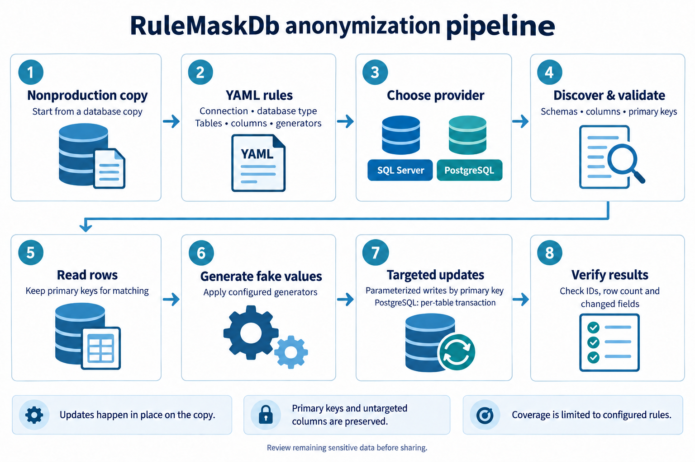
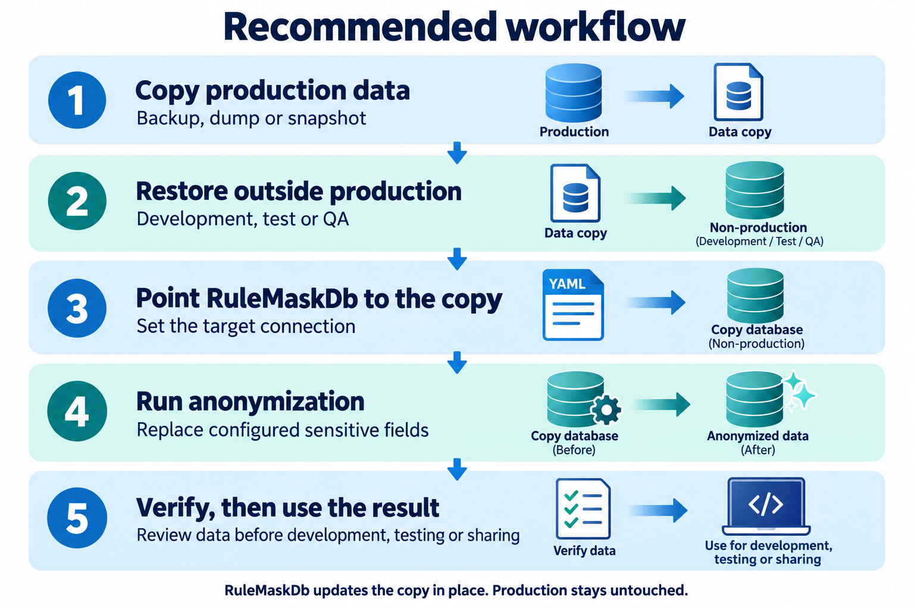
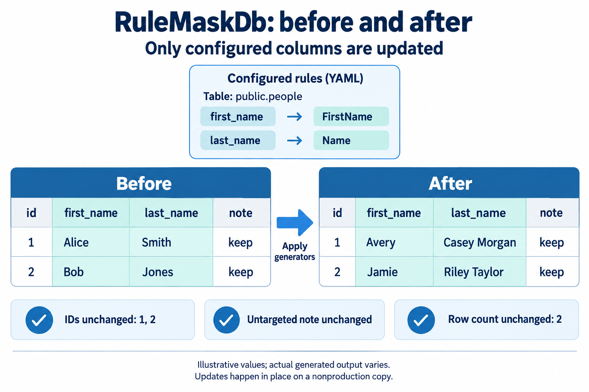

# RuleMaskDb

> **Experimental project:** RuleMaskDb is still experimental. Features and configuration may change.

RuleMaskDb replaces configured sensitive fields directly in a target database using YAML rules and Bogus generators. SQL Server and PostgreSQL are supported; RavenDB is reserved but not implemented. Requires .NET 10.


## In-place anonymization

Use a non-production copy. RuleMaskDb does not clone the database. Only configured columns are covered; review the resulting data for your privacy requirements.



## Recommended workflow

1. Create a copy of your production database (backup, dump or snapshot).
2. Restore it in a non-production environment (development, test or QA).
3. Point RuleMaskDb to this copy using the target connection in your YAML configuration.
4. Run anonymization to replace the configured sensitive fields.
5. Verify the resulting data, then use it for development, testing or sharing.



## PostgreSQL example

See [the runnable YAML example](docs/examples/postgresql.yaml). Its demo credentials refer to the disposable test container below.

```yaml
database:
  type: PostgreSQL
  connectionString: 'Host=127.0.0.1;Port=55433;Database=rulemask_test;Username=postgres;Password=rulemask_test_only'
rules:
  - table: public.people
    column: first_name
    generator: FirstName
  - table: public.people
    column: last_name
    generator: Name
```

From the repository root (PowerShell):

```powershell
$script = (Resolve-Path docs/examples/postgresql.yaml).Path
dotnet run --project src/RuleMaskDb/RuleMaskDb.ConsoleApp -- describe --script $script
dotnet run --project src/RuleMaskDb/RuleMaskDb.ConsoleApp -- run --script $script
```

For SQL Server, use `type: SqlServer`, a SqlClient connection string, and table names such as `dbo.People`. An omitted type defaults to SQL Server; unknown types are rejected.

Use the exact `schema.table` and column names reported by `describe`, including case. These are literal metadata names, not SQL fragments: do not add SQL brackets or double-quote delimiters. Quote YAML strings when necessary. Schema and table identifiers are escaped separately for SQL execution; embedded spaces, dots, brackets and quotes are supported. Ambiguous concatenated table names are rejected.



## Engine behavior

The CLI dispatches schema discovery to the selected provider. A shared ADO.NET runner reads original primary keys, generates replacement values and issues parameterized updates using every component of the primary key. Only targeted columns appear in `SET`; primary keys and untargeted columns are not assigned by the engine.

All rule targets are validated before writes. Missing tables/columns, duplicate column rules, primary-key rules and tables without primary keys fail explicitly. PostgreSQL discovers ordinary and partitioned tables (partition children are not processed twice), columns and primary keys; row counts are exact and may be expensive on large databases.

PostgreSQL commits each table independently and rolls back the current table on failure or cancellation. Previously committed tables remain changed. SQL Server retains row-by-row autocommit, avoiding a long updater transaction that could block its separate streaming reader. Run against an otherwise idle database copy. Database triggers, constraints and generated columns still apply: incompatible values can fail; triggers can have additional effects.

Generators must fit the target column type, length and constraints. Values are normally random; uniqueness and referential consistency for non-PK columns are not guaranteed. `Name` produces a full name. If no generator is supplied, `Name` is used. The legacy `mask` property is parsed but is not applied by the engine.

## Reproducible PostgreSQL tests

Create a dedicated container; ports 5432 and 5433 and existing Pagila instances are not used:

```powershell
docker run --detach --name rulemask-engine-test --publish 127.0.0.1:55433:5432 --env POSTGRES_PASSWORD=rulemask_test_only --env POSTGRES_DB=rulemask_test postgres:17.11
docker exec rulemask-engine-test pg_isready -U postgres -d rulemask_test
$env:RULEMASK_TEST_POSTGRES = 'Host=127.0.0.1;Port=55433;Database=rulemask_test;Username=postgres;Password=rulemask_test_only'
dotnet test src/RuleMaskDb/RuleMaskDb.slnx
```

Wait for `pg_isready` to report accepting connections. Tests create uniquely named schemas and remove only those schemas in teardown. Deterministic test generators verify YAML parsing through real database updates and re-reading by composite ID, including row counts, unchanged fields, case-sensitive columns, escaped identifiers, rejected rules and rollback. Without the environment variable, database tests are skipped. SQL Server escaping and existing unit tests run without a server; live SQL Server is not covered by this PostgreSQL suite.

To try the example CLI in this dedicated container:

```powershell
docker exec rulemask-engine-test psql -U postgres -d rulemask_test -c "CREATE TABLE public.people (id integer PRIMARY KEY, first_name text, last_name text, note text); INSERT INTO public.people VALUES (1, 'Alice', 'Smith', 'keep'), (2, 'Bob', 'Jones', 'keep too');"
# Run describe/run above, then inspect:
docker exec rulemask-engine-test psql -U postgres -d rulemask_test -c 'SELECT * FROM public.people ORDER BY id;'
# Remove only the dedicated test container when finished:
docker rm --force --volumes rulemask-engine-test
```

## Sample datasets

- SQL Server: [Contoso](https://www.microsoft.com/en-us/download/details.aspx?id=54427)
- PostgreSQL: [Pagila](https://github.com/devrimgunduz/pagila)

Restore a separate copy before applying any anonymization rules.

## Docker integration tests

Prerequisites: Docker running Linux containers, Docker Compose v2, and PowerShell
(PowerShell on Windows or `pwsh` on Linux/macOS). SQL Server requires a compatible
x86-64 host; allocate at least 4 GB of memory to Docker.

From the repository root, run:

```powershell
./tests/integration/run.ps1
```

The script builds the console and runner, starts SQL Server and PostgreSQL with
Docker Compose, seeds synthetic data, and checks database values before and after
anonymization. It returns 0 on success and a nonzero code on failure.

Open the [Nginx report](http://localhost:8088). Green check marks with PASS and red
crosses with FAIL identify each test result and summarize each engine. Reports
and console logs are also saved under `tests/integration/reports/`. Nginx stays
available after the runner finishes, including when tests fail.

Run the same command again to recreate the fixtures. To also recreate the test
database volumes, use:

```powershell
./tests/integration/run.ps1 -Reset
```

Stop the services and remove the test database volumes:

```powershell
docker compose -f tests/integration/compose.yaml --profile report down --volumes --remove-orphans
```

See [the integration harness documentation](tests/integration/README.md) for
assertions, negative controls, port configuration, and validated results.
