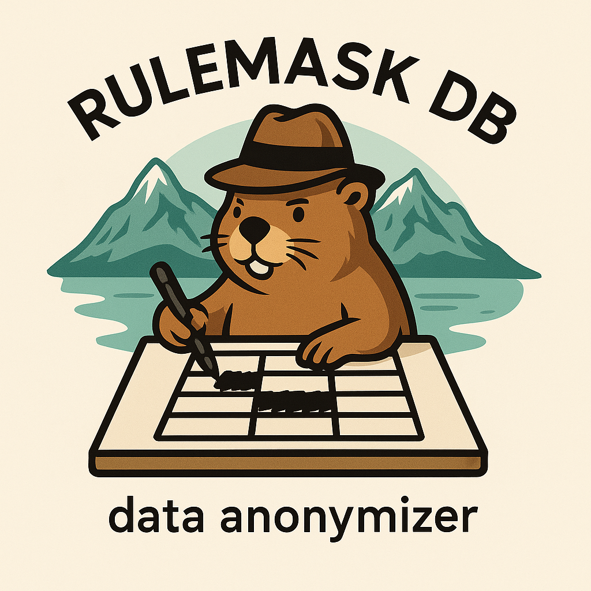

# RuleMaskDb

RuleMaskDb is a generic data anonymization engine designed to replace sensitive information directly inside a target database using a rule-based configuration file (YAML).
It is ideal for preparing safe, realistic datasets for development, testing, QA, or integration environments.

The tool is datastore-agnostic by design (currently focusing on SQL Server, with RavenDB and others planned).



## Important: RuleMaskDb modifies the target database in place

RuleMaskDb does not clone or copy your database.
It performs anonymization directly on the database you point it to.

👉 Therefore, it must never be executed on a production database.

Recommended workflow
- Create a copy of your production database (backup/restore, dump, snapshot, etc.)
- Restore it in a non-production environment (dev/test/QA)
- Point RuleMaskDb to this target
- Run the anonymization
- Use the anonymized database safely in your workflows

This ensures no real production data is ever exposed.

## How it works

RuleMaskDb uses a YAML configuration file to describe:
- which tables or collections should be processed
- which columns or JSON paths must be anonymized
- what generator should be applied to each field (first name, email, phone, unique values, etc.)

Example configuration:

```yaml
rules:
  - target: sql
    table: Users
    column: FirstName
    generator: firstName

  - target: sql
    table: Users
    column: Email
    generator: emailUnique
```

Each rule maps a field to a specific data generator.

## Anonymization principles

- Data is replaced, not removed
- Database schema, constraints, and relationships are preserved
- Bogus-based generators produce realistic fake data
- Unique fields (e.g., login emails) can use dedicated unique generators
- Intended for non-production use only

## Use cases

- Preparing a realistic dataset for developers
- Creating safe test environments
- Providing anonymized datasets to third-party contractors
- Running performance tests, migrations, or automated QA on non-sensitive data
- Ensuring privacy compliance for internal tools


## Sample databases

- SQL Server: Consto https://www.microsoft.com/en-us/download/details.aspx?id=54427
- PostgreSQL: Pagila https://github.com/devrimgunduz/pagila

### Run PostreSQL

```shell
docker run --name postgres -p 5432:5432 -e POSTGRES_USER=rulemask -e POSTGRES_PASSWORD=secret -d postgres
```


```shell
docker exec -it postgres psql -U postgres
```


